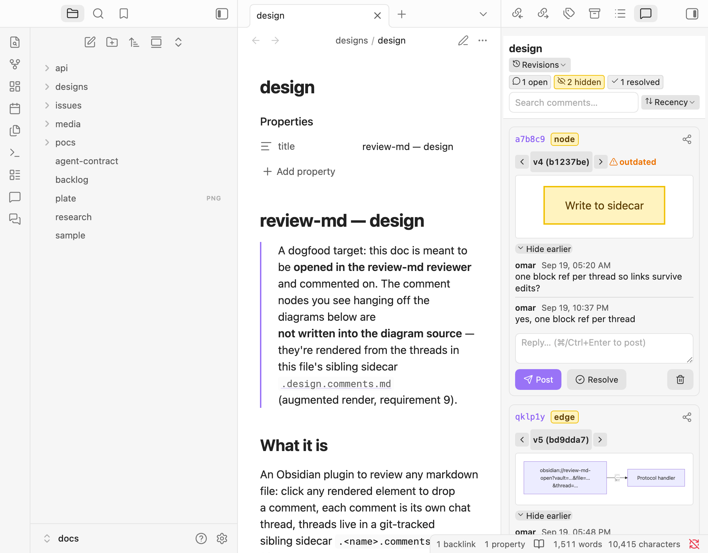
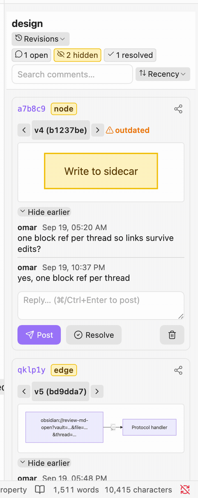
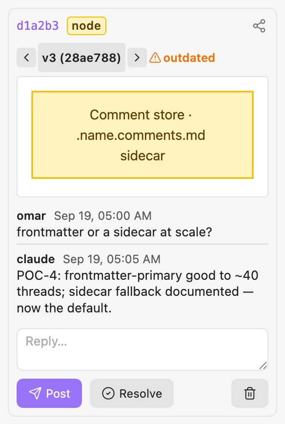
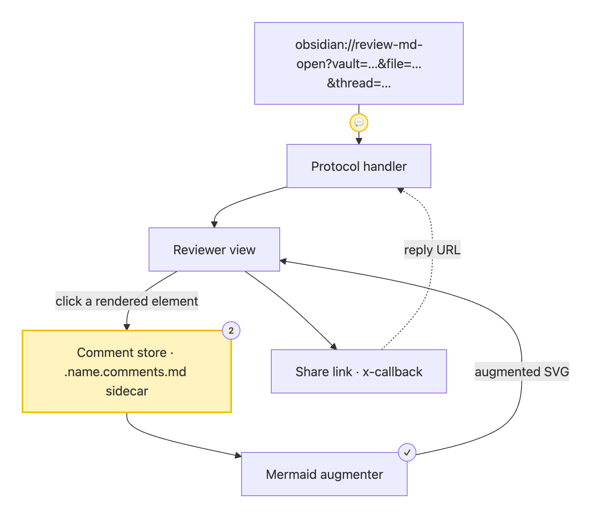
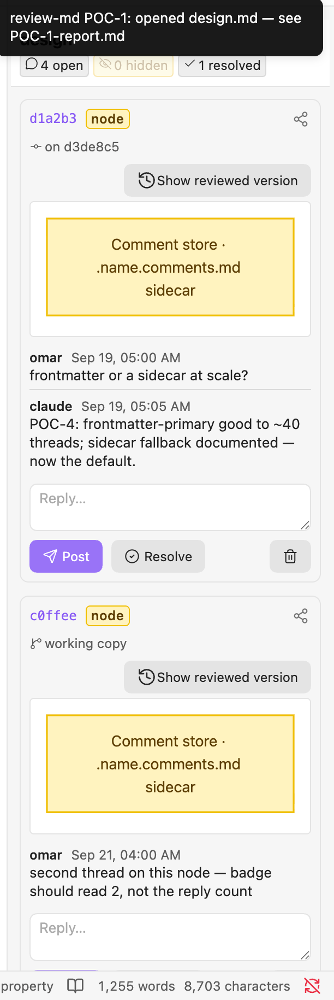
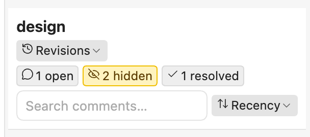

# review-md

**Review any Markdown file the way you review code — but on the _rendered_ page.**
Click any element in a rendered Obsidian doc — a phrase, a heading, an image, even a
node or edge inside a Mermaid diagram — and drop a comment. Each comment is its own
chat thread. Threads live in a git-tracked sibling file, never touching the doc you're
reviewing, and every thread is shareable and repliable through `obsidian://` links.

<p align="center">
  
</p>

> An Obsidian plugin, built for a **split workflow**: you *edit and commit in the CLI*
> (e.g. a terminal or a Claude Code session) and *review in Obsidian*. Because comments
> never land in the reviewed file, commenting never creates a diff on it.

---

## What you can do

- 💬 **Comment on anything rendered** — a phrase or block (`text`), a heading
  (`header`), an image (`image`), or a Mermaid **node**/**edge** (`mermaidNode` /
  `mermaidEdge`). The thread anchors to *that element*, by block-id or diagram-node-id,
  so it survives re-layout and reflow.
- 🧵 **Threaded discussion** — every comment is a chat thread; you, a teammate, and an
  agent (`claude`) reply in order, and **Resolve** closes it.
- 🔗 **Share & reply by link** — any thread emits an `obsidian://review-md-open?…&thread=…`
  URL; a reply URL reopens the file focused on that thread. Full API in
  [`docs/api/xcallback.md`](docs/api/xcallback.md).
- 🧭 **Mermaid comment badges** — threads on a diagram render as recoloured nodes and
  `💬`/count/`✓` badges hung off the diagram **without editing its source**; a **Bake**
  command can fold them in on demand.
- 🕓 **Version-stamped review** — each thread records the version it was made against,
  is flagged **outdated** only when the content *it* anchors to actually changes, and
  can recover the exact reviewed text from git.
- 🗂 **Triage sidebar** — cards carry a type badge and version stamp; header chips
  (**open · hidden · resolved**) filter the list.
- 📝 **Sidecar storage** — threads live in a git-tracked sibling `.<name>.comments.md`
  (YAML source of truth + a GitHub-legible body), so they diff cleanly and any CLI tool
  or agent can read them.

---

## See it

### Share & reply through a deep link (the x-callback path)

An `obsidian://review-md-open` link opens the file focused on a thread; a
`review-md-reply` link posts a reply — no clicking required.

<p align="center">
  
</p>

### A comment thread

Type badge, version stamp (`on <commit>`), the anchored excerpt, the message history,
and the reply box — one self-contained thread.

<p align="center">
  
</p>

### Mermaid comment badges (source untouched)

<p align="center">
  
</p>

### Version stamps & triage chips

A thread stamped `on <commit>` next to one on the **working copy**; the header chips
count and filter open / hidden / resolved.

<p align="center">
  
  &nbsp;&nbsp;
  
</p>

---

## Install

review-md is desktop-only and not yet in the community-plugin store, so install it
manually for now.

### From source (recommended today)

```sh
git clone https://github.com/omars-lab/review-md
cd review-md
nvm use            # Node from .nvmrc (v22.22.3)
npm install
npm run build      # → main.js
```

Then copy the three build artifacts into your vault and enable the plugin:

```sh
# from the repo, with VAULT pointing at your Obsidian vault:
mkdir -p "$VAULT/.obsidian/plugins/review-md"
cp main.js manifest.json styles.css "$VAULT/.obsidian/plugins/review-md/"
```

In Obsidian: **Settings → Community plugins → turn off Restricted mode** (if needed),
then enable **review-md**. Open any Markdown file and run **review-md: Open comments
view** from the command palette (or click a rendered element to start a thread).

### Try it in a throwaway vault

Want to see it working without touching your own vault? The repo ships a dev vault:

```sh
npm run install:dev   # installs the plugin into docs/ (the dev vault) + a sample doc
```

Open the `docs/` folder as a vault in Obsidian and open `designs/design.md` — a
git-tracked dogfood doc that comes with live comment threads.

### Community store / BRAT

Planned, not yet available. Until then, use the source install above.

---

## The review workflow

review-md assumes **commits happen in the CLI, reviews happen in Obsidian**:

1. You change files and `git commit` in a terminal (or an agent session) — never in
   Obsidian.
2. You open the doc in Obsidian, drop threads, reply, resolve. Obsidian only ever writes
   the sidecar.
3. You can comment on the **uncommitted working copy**; when the CLI later commits the
   file, a **post-commit hook** re-anchors those threads to the landed commit.

See [`docs/designs/design.md`](docs/designs/design.md) (a dogfood doc — open it *in* the
reviewer for the full experience) and [`docs/issues/`](docs/issues/) for the design rationale.

---

## Develop

```sh
nvm use
npm install
npm run dev        # esbuild watch → main.js
npm run install:dev  # set up / refresh the .dev-vault harness
make check         # the full local gate (typecheck · api-check · validate · secrets)
make hooks         # install the pre-commit + post-commit git hooks
```

**Marketing media** (this README's screenshots and GIFs) is captured with the
[`demo-media`](.claude/skills/demo-media/SKILL.md) skill, which drives the live plugin
via `scripts/capture-media.mjs` (both a command-driven *manual* path and an
`obsidian://` *x-callback* path) and stitches GIFs with ffmpeg/gifski. Re-run its
[`shot-list.md`](.claude/skills/demo-media/shot-list.md) to refresh every asset.

---

## Security / secrets

- **gitleaks** runs on every commit (pre-commit) and as `npm run secrets`.
- **dotenvx**: local secrets go in an encrypted `.env` (committable); the private key
  lives in `.env.keys`, which is git-ignored. **Never commit `.env.keys`.**
- The dotenvx private key is backed up in **LastPass** at
  `dotenvx/review-md/DOTENV_PRIVATE_KEY` (Password field). Restore a fresh checkout's key
  with `make env-restore` (requires `lpass login`).

## License

MIT
