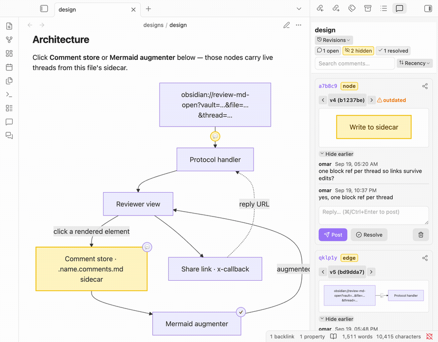
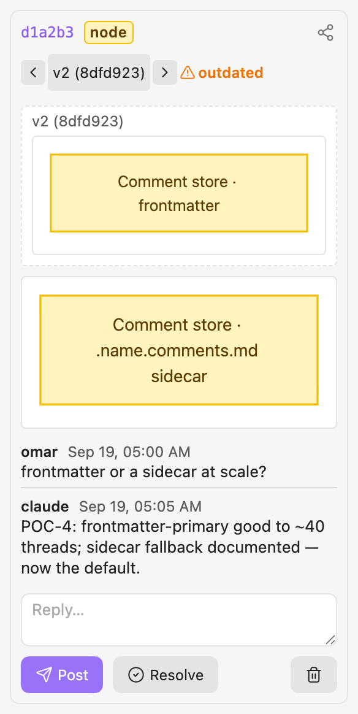
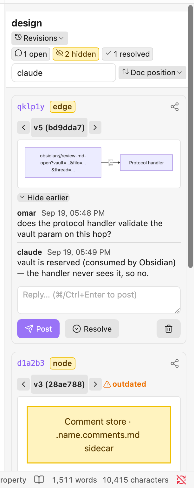
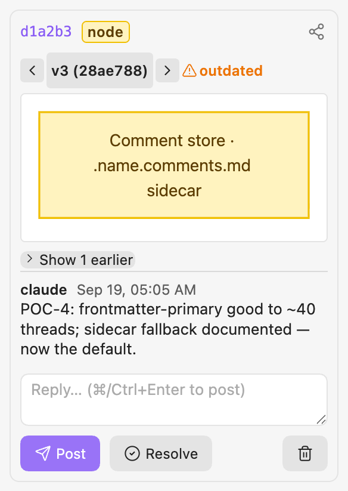

# review-md

**Review any Markdown file the way you review code — but on the _rendered_ page.**
Click any element in a rendered Obsidian doc — a phrase, a heading, an image, even a
node or edge inside a Mermaid diagram — and drop a comment. Each comment is its own
chat thread. Threads live in a git-tracked sibling file, not in the doc you're
reviewing, and every thread is shareable and repliable through `obsidian://` links.

<p align="center">
  
</p>

> An Obsidian plugin, built for a **split workflow**: you *edit and commit in the CLI*
> (e.g. a terminal or a Claude Code session) and *review in Obsidian*. Comment text never
> lands in the reviewed file; the only thing a comment can add to it is a native
> `^block-id` on the anchored block (text anchors only), so the doc's content is never
> touched.

---

## What you can do

- 💬 **Comment on anything rendered** — a phrase or block (`text`), a heading
  (`header`), an image (`image`), or a Mermaid **node**/**edge** (`mermaidNode` /
  `mermaidEdge`). The thread anchors to *that element*, by block-id or diagram-node-id,
  so it survives re-layout and reflow.
- ✍️ **Comment mode with a draft composer** — toggle comment mode (the status bar says
  so), click an element, and a draft card with the anchor preview opens in the sidebar.
  The thread is written only when you hit **Comment**; a mis-click costs nothing.
- 🧵 **Threaded discussion** — every comment is a chat thread; you, a teammate, and an
  agent (`claude`) reply in order (⌘/Ctrl+Enter posts, bodies render as Markdown), and
  **Resolve** closes it. Your reviewer name is a setting.
- 🔗 **Share & reply by link** — any thread emits an `obsidian://review-md-open?…&thread=…`
  URL; a reply URL reopens the file focused on that thread. Full API in
  [`docs/api/xcallback.md`](docs/api/xcallback.md).
- 🧭 **Mermaid comment badges** — threads on a diagram render as recoloured nodes and
  `💬`/count/`✓` badges hung off the diagram **without editing its source**; a **Bake**
  command can fold them in on demand.
- 🕓 **Version-stamped review** — each thread records the version it was made against
  and is flagged **outdated** only when the content *it* anchors to actually changes. An
  inline **version stepper** walks the anchored element back through every git revision,
  rendering it — diagram or text — exactly as it was in each version.
- 🗂 **Triage sidebar** — cards carry a type badge and a version stepper. The sticky
  header filters with chips (**open · hidden · resolved**) and a **Revisions** dropdown
  (only threads authored against one version of the doc, or the working copy), searches across bodies,
  authors and anchors, and sorts by **recency**, **doc position** or **author**; long
  threads fold to their latest message (**Show N earlier**). Edits update the one card
  they touch, so the list never jumps under you.
- 📝 **Sidecar storage** — threads live in a git-tracked sibling `.<name>.comments.md`
  (YAML source of truth + a GitHub-legible body), so they diff cleanly and any CLI tool
  or agent can read them.
- 🤖 **Hand the feedback to an AI** — **Copy open threads for AI** (this file or the whole
  vault) puts every open thread on the clipboard as one Markdown digest: where it's
  anchored, whether it's outdated, the messages, and a reply link per thread. Paste it into
  any chat. The same digest comes from `obsidian://review-md-export` (with `text=` to
  pick threads mentioning some words) or from the [`reviews` CLI](#for-ai-tools-and-scripts).

---

## See it

### Create a thread: comment mode → click → draft → thread

Toggle comment mode (the status bar shows it), click the rendered element, write in
the draft card that opens in the sidebar, and hit **Comment**. Nothing is written until
you do.

<p align="center">
  
</p>

### Share & reply through a deep link (the x-callback path)

An `obsidian://review-md-open` link opens the file focused on a thread; a
`review-md-reply` link posts a reply — no clicking required.

<p align="center">
  
</p>

### A comment thread

Type badge, the version stepper, the anchored excerpt, the message history,
and the reply box — one self-contained thread.

<p align="center">
  
</p>

### Mermaid comment badges (source untouched)

<p align="center">
  
</p>

### Version stepper

Each card's rev line is an inline stepper — `‹ vN (sha) ›` walks the anchored element
through the file's git history (left = newer, right = older), rendering it **as it was**
in each version. Here the `CS` node read *"… frontmatter"* at **v2** but *"… sidecar"*
now — the very drift the thread was debating.

<p align="center">
  
</p>

### Triage: chips, search, sort, fold

The sticky header counts and filters open / hidden / resolved, searches every thread,
and sorts by recency, doc position or author. Left: a search for `claude` in doc
order. Right: a long thread folded to its latest message behind **Show 1 earlier**.

<p align="center">
  
  &nbsp;&nbsp;
  
</p>

---

## Install

review-md is desktop-only. It's not in the community-plugin store yet
([planned](docs/backlog.md)), so the easiest install today is **BRAT**.

### Easiest: BRAT (auto-updating)

[BRAT](https://github.com/TfTHacker/obsidian42-brat) installs a plugin straight from
a GitHub repo and keeps it updated — no cloning, no build.

1. In Obsidian, install and enable the **BRAT** community plugin.
2. Command palette → **BRAT: Add a beta plugin** → paste `omars-lab/review-md`.
3. Enable **Review MD** under Settings → Community plugins.

BRAT then pulls new versions automatically whenever a release is cut.

From a clone, the same install runs from the shell: `make setup-check VAULT=/abs/vault`
→ `make setup-install VAULT=/abs/vault` → `make setup-verify VAULT=<vault name>` (needs the
vault open with Settings → General → Command line interface on; details in the
[`setup-review-md`](.claude/skills/setup-review-md/SKILL.md) skill).

### Into your own vault, from source

If you'd rather build it yourself and drop it straight into a vault:

```sh
git clone https://github.com/omars-lab/review-md
cd review-md
nvm use                              # Node from .nvmrc (v22.22.3)
npm install
make install-vault VAULT=/path/to/your/vault   # build + copy the plugin in
```

Then enable **Review MD** under Settings → Community plugins (turn off Restricted
mode first if this is a fresh vault). Open any Markdown file and run **review-md:
Open comments view** from the command palette, or click a rendered element to start
a thread.

### Try it in a throwaway vault

Want to see it working without touching your own vault? The repo ships a dev vault:

```sh
npm run install:dev   # symlinks the plugin into docs/ (the dev vault) + a sample doc
```

Open the `docs/` folder as a vault in Obsidian and open `designs/design.md` — a
git-tracked dogfood doc that comes with live comment threads.

### Cutting a release (maintainers)

Releases are manual — no GitHub Actions. Bump the version in lock-step, commit, then
publish a GitHub release BRAT/​the store install from (needs an authenticated `gh`):

```sh
make version V=1.0.0   # updates manifest.json + package.json + versions.json together
git commit -am "Release 1.0.0"
make release-check     # validate readiness (version consistency, assets, clean tree)
make release           # cuts the GitHub release; tag == manifest version, exactly
```

---

## The review workflow

review-md assumes **commits happen in the CLI, reviews happen in Obsidian**:

1. You change files and `git commit` in a terminal (or an agent session) — never in
   Obsidian.
2. You open the doc in Obsidian, drop threads, reply, resolve. Obsidian only ever writes
   the sidecar.
3. You can comment on the **uncommitted working copy**; when the CLI later commits the
   file, a **post-commit hook** re-anchors those threads to the landed commit.

See [`docs/designs/design.md`](docs/designs/design.md) (a dogfood doc — open it *in* the
reviewer for the full experience) and [`docs/issues/`](docs/issues/) for the design rationale.

---

## For AI tools and scripts

An agent working in the repo can read and answer the review without opening Obsidian.
The `reviews` command line reads the sidecars straight from the clone; replying goes
through Obsidian, so the plugin stays the only thing that writes them.

```sh
npm run reviews -- help                                   # every command, with examples
npm run reviews -- stats docs                             # where is feedback waiting?
npm run reviews -- list docs --open --waiting claude      # open threads waiting on claude
npm run reviews -- find "frontmatter" docs                # threads mentioning some words
npm run reviews -- show docs/designs/design.md d1a2b3     # one thread in full
npm run reviews -- reply docs/designs/design.md d1a2b3 "Fixed in abc123." --author claude
```

Add `--json` to `list`/`find`/`show`/`stats` for structured output. The data format and
exit codes are in [`docs/agent-contract.md`](docs/agent-contract.md).

For Claude Code, the [`reviews` skill](.claude/skills/reviews/SKILL.md) runs the whole loop:
find what's waiting → fix the doc or answer → reply on the thread. Its
[`notes.md`](.claude/skills/reviews/notes.md) records what the CLI was missing in real
use, which is where the next features come from.

No shell? From inside Obsidian, **Copy open threads for AI** or
`obsidian://review-md-export?vault=<vault>[&file=<path>][&text=<words>][&resolved=include]`
puts the same digest on the clipboard.

---

## Develop

```sh
nvm use
npm install
npm run dev        # esbuild watch → main.js
npm run install:dev  # set up / refresh the .dev-vault harness
make test          # unit tests for the pure logic (node --test, no deps)
make check         # the full local gate (typecheck · test · api-check · validate · secrets)
make hooks         # install the pre-commit + post-commit git hooks
```

**Marketing media** (this README's screenshots and GIFs) is captured with the
[`demo-media`](.claude/skills/demo-media/SKILL.md) skill, which drives the live plugin
via `scripts/capture-media.mjs` (both a command-driven *manual* path and an
`obsidian://` *x-callback* path) and stitches GIFs with ffmpeg/gifski. Re-run its
[`shot-list.md`](.claude/skills/demo-media/shot-list.md) to refresh every asset.

---

## Security / secrets

- **gitleaks** runs on every commit (pre-commit) and as `npm run secrets`.
- **dotenvx**: local secrets go in an encrypted `.env` (committable); the private key
  lives in `.env.keys`, which is git-ignored. **Never commit `.env.keys`.**
- The dotenvx private key is backed up in **LastPass** at
  `dotenvx/review-md/DOTENV_PRIVATE_KEY` (Password field). Restore a fresh checkout's key
  with `make env-restore` (requires `lpass login`).

## License

MIT
