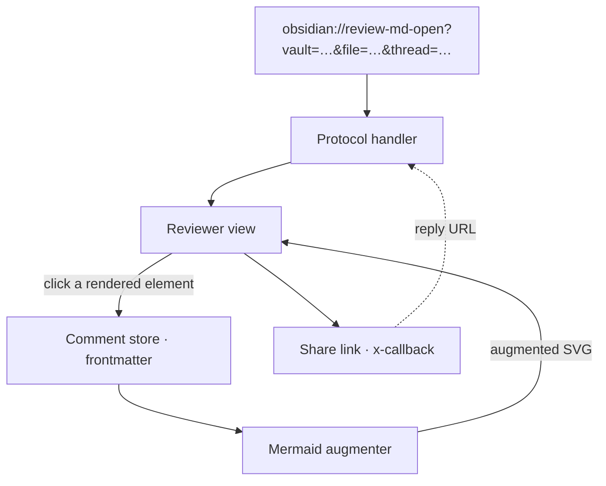
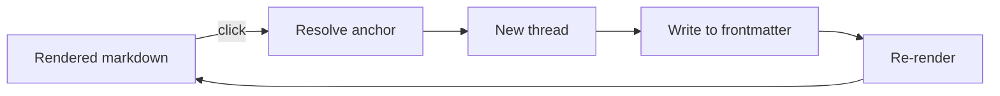
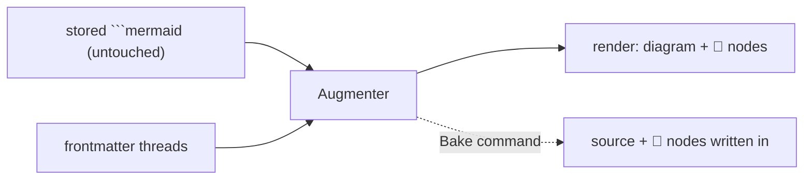

# review-md — design

> A dogfood target: this doc is meant to be **opened in the review-md reviewer**
> and commented on. The comment nodes you see hanging off the diagrams below are
> **not written into the diagram source** — they're rendered from the `review.threads`
> in this file's frontmatter (augmented render, requirement 9).

## What it is

An Obsidian plugin to review any markdown file: click any rendered element to drop
a comment, each comment is its own chat thread, threads live in the file's
frontmatter (git-friendly, agent-parseable), and threads are shareable/repliable via
`obsidian://` x-callback URLs. The full URL API (one action per operation:
`review-md-open`, `review-md-reply`) is documented in [`docs/api/`](docs/api/xcallback.md)
— generated from `src/protocol/xcallback.schema.json` and kept in sync by a pre-commit hook.

## Architecture

Click **Comment store** or **Mermaid augmenter** below — those nodes carry live
threads from this file's frontmatter.



## Comment lifecycle



## Anchor types

| type | anchors to | key fields |
|---|---|---|
| `text` | a phrase / block | `line`, `blockId`, `quote` |
| `image` | a whole image | `src` (coords deferred → backlog) |
| `mermaidNode` | a diagram node | `blockId`, `node`, `quote` |

## Storage schema (frontmatter)

```yaml
review:
  uid: <stable file id>
  threads:
    - id: <short id>          # also the ^blockId link target
      anchor: { type, … }
      resolved: false
      messages:
        - { author, ts, body }
```

## Requirement 9 — mermaid comment nodes

Threads on a diagram node stay in frontmatter. At render time the plugin re-renders
`original source + injected comment nodes` (diagram source untouched), and a
"Bake comments into diagram" command can fold them into the source on demand.


