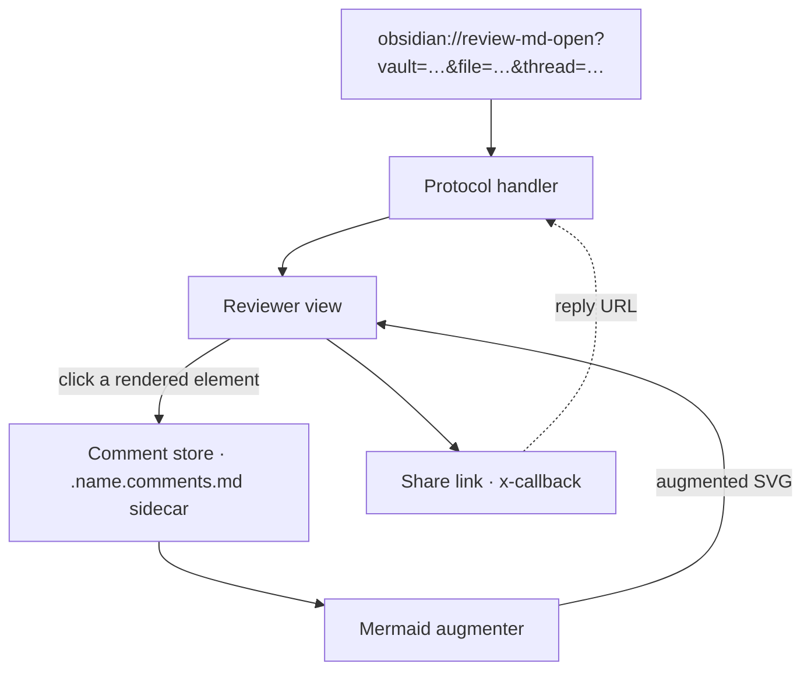
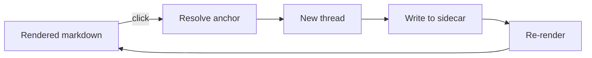
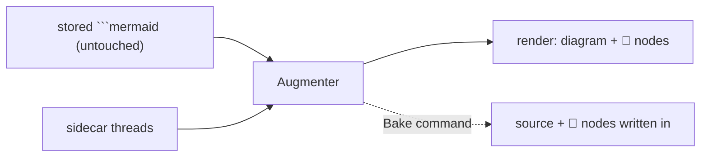

# review-md — design

> A dogfood target: this doc is meant to be **opened in the review-md reviewer**
> and commented on. The comment nodes you see hanging off the diagrams below are
> **not written into the diagram source** — they're rendered from the threads in
> this file's sibling sidecar [`.design.comments.md`](.design.comments.md)
> (augmented render, requirement 9).

## What it is

An Obsidian plugin to review any markdown file: click any rendered element to drop
a comment, each comment is its own chat thread, threads live in a git-tracked
sibling sidecar `.<name>.comments.md` (git-friendly, agent-parseable, and — since
comments never touch the reviewed file — commenting creates no revision on it),
and threads are shareable/repliable via
`obsidian://` x-callback URLs. The full URL API (one action per operation:
`review-md-open`, `review-md-reply`) is documented in [`docs/api/`](docs/api/xcallback.md)
— generated from `src/protocol/xcallback.schema.json` and kept in sync by a pre-commit hook.

## Architecture

Click **Comment store** or **Mermaid augmenter** below — those nodes carry live
threads from this file's sidecar.



## Comment lifecycle



## Anchor types

| type | anchors to | key fields |
|---|---|---|
| `text` | a phrase / block | `line`, `blockId`, `quote` |
| `image` | a whole image | `src` (coords deferred → backlog) |
| `mermaidNode` | a diagram node | `blockId`, `node`, `quote` |

## Storage schema (sidecar)

Threads live in a git-tracked sibling `.<name>.comments.md`. Its own frontmatter
holds a `review:` block (the source of truth); a generated markdown body below it
makes the file legible on GitHub. See
[`docs/issues/comment-sidecar.md`](docs/issues/comment-sidecar.md).

```yaml
# .<name>.comments.md frontmatter
review:
  uid: <stable file id>
  threads:
    - id: <short id>          # also the ^blockId link target
      anchor: { type, … }
      resolved: false
      rev:                    # version the comment was authored against
        bodyHash: <sha256>    #   body hash of the REVIEWED file, frontmatter stripped
        ts: <iso8601>
        git: { commit, blob } #   present only when the reviewed file is git-tracked
      messages:
        - { author, ts, body }
```

`rev` stamps the reviewed version so a thread can be flagged **outdated** when the
reviewed body later changes, and the exact reviewed text retrieved (`git show
<commit>:<file>`). `bodyHash` hashes the reviewed file's body only; because
comments now live in the sidecar, commenting never revises the reviewed file at
all. See [`docs/issues/version-stamping.md`](docs/issues/version-stamping.md).

## Requirement 9 — mermaid comment nodes

Threads on a diagram node live in the sidecar. At render time the plugin re-renders
`original source + injected comment nodes` (diagram source untouched), and a
"Bake comments into diagram" command can fold them into the source on demand.


