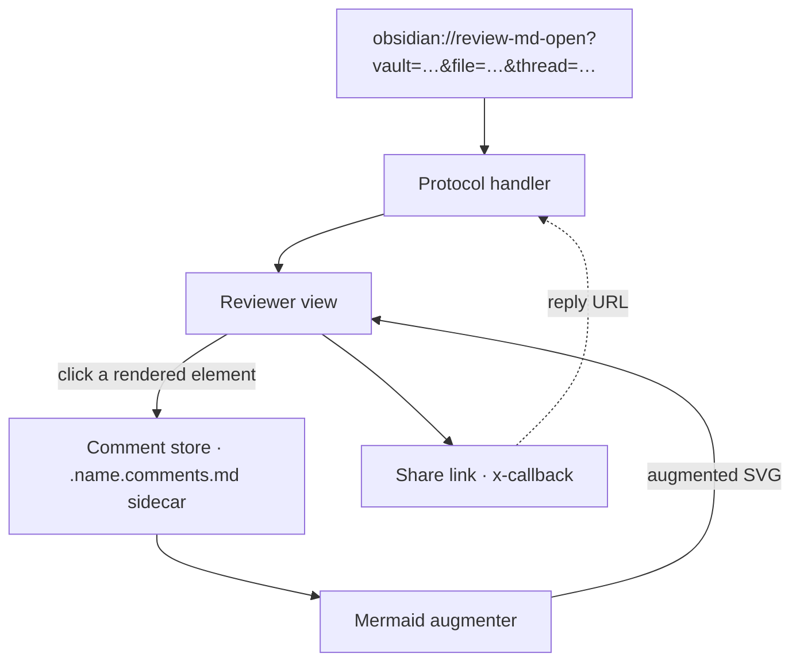
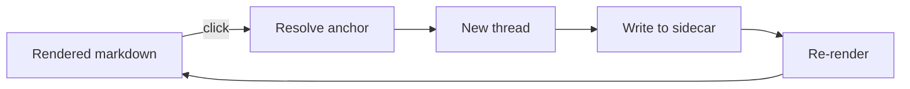
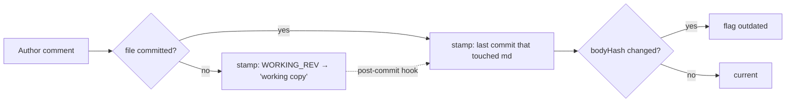
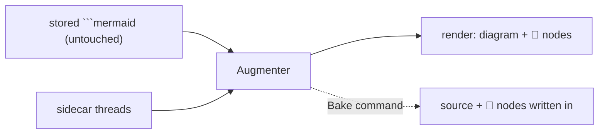

# review-md — design

> A dogfood target: this doc is meant to be **opened in the review-md reviewer**
> and commented on. The comment nodes you see hanging off the diagrams below are
> **not written into the diagram source** — they're rendered from the threads in
> this file's sibling sidecar [`.design.comments.md`](.design.comments.md)
> (augmented render, requirement 9).

## What it is

An Obsidian plugin to review any markdown file: click any rendered element to drop
a comment, each comment is its own chat thread, threads live in a git-tracked
sibling sidecar `.<name>.comments.md` (git-friendly, agent-parseable, and — since
comments never touch the reviewed file — commenting creates no revision on it),
and threads are shareable/repliable via
`obsidian://` x-callback URLs. The full URL API (one action per operation:
`review-md-open`, `review-md-reply`) is documented in [`docs/api/`](docs/api/xcallback.md)
— generated from `src/protocol/xcallback.schema.json` and kept in sync by a pre-commit hook.

## How it's used — the primary workflow

review-md assumes a **split workflow**, and its design follows from it:

- **Editing and committing happen in the CLI** — typically a Claude Code session
  (or a plain terminal). The developer changes the files and runs `git commit`
  there. **Commits never originate in Obsidian.**
- **Reviewing happens in Obsidian** — the reviewer opens the doc in the review-md
  reviewer, drops threads, replies, resolves. Obsidian is read-mostly for the
  artifact itself; it writes only the sidecar.

Two consequences shape the version-tracking design:

1. Because the reviewer can comment on work the CLI hasn't committed yet, a thread
   can be authored against the **uncommitted working copy** (use case 9).
2. Because the *commit* fires in the CLI — with Obsidian possibly closed and the
   plugin not running — the step that re-anchors those working threads to the
   landed commit must run **at git-commit time**, as a **post-commit hook**, not
   inside the plugin. See [Version tracking](#version-tracking).

## Use cases — what the tool powers

The complete set of things a reviewer can do with review-md today, each backed by a
section below or an issue note under [`docs/issues/`](docs/issues/):

1. **Comment on prose** — click a phrase, block, or heading in the rendered
   markdown and start a thread anchored to it (`text` / `header` anchors).
2. **Comment on a diagram element** — click a mermaid **node** or **edge** and the
   thread anchors to that element by id, surviving re-layout (`mermaidNode` /
   `mermaidEdge`).
3. **Comment on an image** — click a rendered image to anchor a thread to it
   (`image`; sub-image region coords are on the backlog).
4. **Threaded discussion** — every comment is its own chat thread; author, teammate,
   and agent (`claude`) messages append in order; **Resolve** closes a thread.
5. **Augmented diagram render** — mermaid threads render as 💬 comment nodes hung off
   the diagram **without touching the diagram source** (requirement 9); a **Bake**
   command can fold them into the source on demand.
6. **Live-Preview parity** — the same click-to-comment + mermaid overlay works in
   Obsidian's Live Preview, not only Reading view (see
   [`docs/issues/live-preview-mermaid-overlay.md`](docs/issues/live-preview-mermaid-overlay.md)).
7. **Share / reply by link** — any thread produces an `obsidian://review-md-open?…&thread=…`
   URL; a reply URL reopens the file focused on that thread (x-callback API).
8. **Version-stamped review** — each thread records the artifact version it was made
   against, is flagged **outdated** when the reviewed text drifts, and can recover the
   exact reviewed text via git. See [Version tracking](#version-tracking).
9. **Review before commit** — comment on the uncommitted **working copy** in
   Obsidian; when the CLI later commits the file, a **post-commit hook** re-anchors
   those threads to the landed commit (tasks #41–#42). The hook — not the plugin —
   owns this step, because the commit happens in the CLI with Obsidian possibly
   closed.
10. **Triage the sidebar** — cards carry a content-type badge and version stamp;
    header **filter chips** (open / hidden / resolved) narrow the list. See
    [Reviewer sidebar](#reviewer-sidebar).

## Architecture

Click **Comment store** or **Mermaid augmenter** below — those nodes carry live
threads from this file's sidecar.



## Comment lifecycle



## Anchor types

| type | anchors to | key fields |
|---|---|---|
| `text` | a phrase / block | `line`, `blockId`, `quote` |
| `header` | a heading | `blockId`, `quote` |
| `image` | a whole image | `src` (coords deferred → backlog) |
| `mermaidNode` | a diagram node | `blockId`, `node`, `quote` |
| `mermaidEdge` | a diagram edge | `blockId`, `from`, `to`, `index`, `quote` |

## Storage schema (sidecar)

Threads live in a git-tracked sibling `.<name>.comments.md`. Its own frontmatter
holds a `review:` block (the source of truth); a generated markdown body below it
makes the file legible on GitHub. See
[`docs/issues/comment-sidecar.md`](docs/issues/comment-sidecar.md).

```yaml
# .<name>.comments.md frontmatter
review:
  uid: <stable file id>
  threads:
    - id: <short id>          # also the ^blockId link target
      anchor: { type, … }
      resolved: false
      rev:                    # version the comment was authored against
        bodyHash: <sha256>    #   body hash of the REVIEWED file, frontmatter stripped
        ts: <iso8601>
        git: { commit, blob } #   present only when the reviewed file is git-tracked
      messages:
        - { author, ts, body }
```

`rev` stamps the reviewed version so a thread can be flagged **outdated** when the
reviewed body later changes, and the exact reviewed text retrieved (`git show
<commit>:<file>`). `bodyHash` hashes the reviewed file's body only; because
comments now live in the sidecar, commenting never revises the reviewed file at
all. See [`docs/issues/version-stamping.md`](docs/issues/version-stamping.md).

## Version tracking

A comment records **which version of the artifact it was made against**, so the
sidebar can say "commented on `<commit>`", flag a thread **outdated** when the text
drifts, and recover the exact reviewed text. The model has three parts:

- **Committed version = the last commit that *touched* the md, not HEAD.** HEAD
  advances with every unrelated commit; the file's real version is the last commit
  that changed it (`git rev-list -1 --abbrev-commit HEAD -- <path>`). Example: a
  thread on a file last edited in `50ba884` stays stamped `on 50ba884` even after
  three later commits move HEAD on without touching it.
- **Staleness is `bodyHash` alone.** The current body hash (frontmatter stripped)
  differs from the stored `rev.bodyHash` → **outdated**. This is git-free (works in
  a plain vault), fires pre-commit, and — because the body excludes frontmatter —
  never trips on comment churn. `git.commit`/`git.blob` are for identity and
  retrieval only, never staleness.
- **Working copy → commit re-anchor.** A thread authored against the uncommitted
  working tree is stamped with the `WORKING_REV` sentinel and shown as **"working
  copy"**, recording the working-tree blob (`git hash-object`). When the CLI later
  commits the file, a **post-commit hook** (installed via `make hooks`, run by the
  pre-commit framework) re-anchors those threads: for each `WORKING_REV` thread it
  matches the recorded blob against `HEAD:<reviewed-path>`, and on a match swaps
  `WORKING_REV` for the real last-touching `git.commit` (the blob is already
  identical). The re-anchored sidecar is left as a working change for the same CLI
  session to commit. The hook — not the plugin — owns this because the commit fires
  in the CLI (tasks #41–#42). See
  [`docs/issues/reanchor-hook.md`](docs/issues/reanchor-hook.md).



See [`docs/issues/version-stamping.md`](docs/issues/version-stamping.md) for the
full rationale (why body hash, why the committed blob, the last-touch pivot).

## Reviewer sidebar

Each thread renders as a card; the panel header aggregates and filters them.

- **Card header** — the short thread id, a **content-type badge**
  (`node` / `edge` / `text` / `header` / `image`) since the excerpt below already
  shows *which* element, and a **share** icon (top-right) that emits the thread's
  x-callback URL.
- **Version stamp** — `on <commit>` (or **"working copy"**), with an **outdated**
  warning when the reviewed body has drifted, plus a **Show reviewed version**
  action to recover the text the comment was made against.
- **Excerpt / preview** — the anchored text, or for a mermaid node/edge a mini
  re-render of just that element, recoloured to match the augmented diagram.
- **Action row** — **Post** (add a message), **Resolve**, and **delete**, together.
- **Header filter chips** — **N open · N hidden · N resolved** (a thread is
  *hidden* when its version text has drifted); clicking a chip toggles that
  category in the list.

## Requirement 9 — mermaid comment nodes

Threads on a diagram node live in the sidecar. At render time the plugin re-renders
`original source + injected comment nodes` (diagram source untouched), and a
"Bake comments into diagram" command can fold them into the source on demand.


